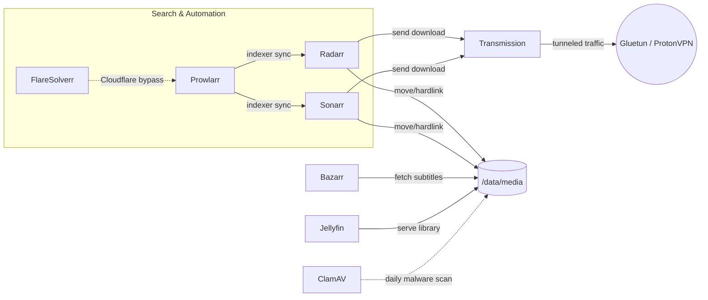

# videopozicovna — self-hosted home cinema stack

A Docker Compose stack for a self-managed movie/TV library: automatic search,
download, subtitles, and streaming, with the downloader routed through a VPN
tunnel for privacy and NAT traversal.

## Architecture



| Service | Role | Port |
|---|---|---|
| Jellyfin | Media server (streams your library) | 8096 |
| Prowlarr | Indexer manager (feeds Radarr/Sonarr) | 9696 |
| Radarr | Movie search/download manager | 7878 |
| Sonarr | TV show search/download manager | 8989 |
| Bazarr | Subtitle downloader | 6767 |
| Transmission | Torrent client (network routed through Gluetun) | 9091 |
| Gluetun | ProtonVPN WireGuard gateway + port forwarding | — |
| port-sync | Auto-syncs Gluetun's forwarded port into Transmission | — |
| FlareSolverr | Solves Cloudflare challenges for Prowlarr | — |
| ClamAV | Daily malware scan of files added in the last 24h | — |

## Prerequisites

- Docker + Docker Compose v2 (`docker compose version`)
- A Linux host (this stack is designed to run there — see "Why Linux" below)
- A **ProtonVPN Plus** (or higher) account, for WireGuard + NAT-PMP port forwarding

## Folder structure

Two host directories hold everything, defined by `DATA_ROOT` and `CONFIG_ROOT`
in `.env`:

```
${DATA_ROOT}/
  media/
    movies/
    tv/
  torrents/
    complete/
    incomplete/

${CONFIG_ROOT}/
  jellyfin/  prowlarr/  radarr/  sonarr/  bazarr/  gluetun/  transmission/
```

Radarr and Sonarr mount the whole `${DATA_ROOT}` (as `/data`) so they can
**hardlink** completed downloads into the media library instead of copying
them (same filesystem = instant, no duplicate disk usage). Jellyfin and
Bazarr only need `/data/media`. Transmission only needs `/data/torrents`.

## Setup

1. Clone this repo onto your Linux server.
2. Copy the env template and fill in real values:
   ```bash
   cp .env.example .env
   ```
   - `PUID`/`PGID`: run `id -u` / `id -g` to find your user's IDs.
   - `TRANSMISSION_USER` / `TRANSMISSION_PASS`: pick your own credentials.
   - `DATA_ROOT` / `CONFIG_ROOT`: where the folders above should live on disk.
3. Get your ProtonVPN WireGuard config:
   - Log in at [account.protonvpn.com](https://account.protonvpn.com) → **Downloads** → **WireGuard configuration**.
   - Platform: **Router**. Enable **NAT-PMP (Port Forwarding)**. Pick a server (or a country).
   - Download the `.conf` file, open it, and copy into `.env`:
     - `PrivateKey` → `PROTONVPN_WIREGUARD_PRIVATE_KEY`
     - `Address` (IPv4 part only, e.g. `10.2.0.2/32`) → `PROTONVPN_WIREGUARD_ADDRESSES`
   - Delete the downloaded `.conf` file once copied — it contains a real private key.
4. Create the host folders and fix permissions:
   ```bash
   sudo ./setup.sh
   ```
5. Start the stack:
   ```bash
   docker compose up -d
   ```

## Environment variables

| Variable | Description |
|---|---|
| `PUID` / `PGID` | Linux user/group ID the containers run as (controls file ownership) |
| `TZ` | Timezone, e.g. `Europe/Bratislava` |
| `TRANSMISSION_USER` / `TRANSMISSION_PASS` | Transmission web UI login |
| `DATA_ROOT` | Host path for media + torrents |
| `CONFIG_ROOT` | Host path for each app's config/database |
| `PROTONVPN_WIREGUARD_PRIVATE_KEY` | From your ProtonVPN WireGuard config |
| `PROTONVPN_WIREGUARD_ADDRESSES` | From your ProtonVPN WireGuard config (IPv4 `/32`) |
| `PROTONVPN_SERVER_COUNTRY` | Country to connect to, e.g. `Czech Republic` |

## First-time configuration order

Configure the apps in this order — each step depends on the previous one:

1. **Prowlarr** (`:9696`) — add indexers. For Cloudflare-protected ones, add a
   FlareSolverr entry under Settings → Indexers, pointing at
   `http://flaresolverr:8191`, and tag the relevant indexers with it. Then
   under Settings → Apps, add Radarr (`http://radarr:7878`) and Sonarr
   (`http://sonarr:8989`) so indexers sync automatically.
2. **Radarr / Sonarr** (`:7878` / `:8989`) — set root folder to `/data/media/movies`
   or `/data/media/tv`. Add Transmission as a download client:
   `http://gluetun:9091` (Transmission's port is exposed on the `gluetun`
   service since they share a network namespace), with your
   `TRANSMISSION_USER` / `TRANSMISSION_PASS`. No remote path mapping should be
   needed as long as Transmission's own download directory is set under
   `/data/torrents/...` (matching the shared mount).
3. **Bazarr** (`:6767`) — connect to Radarr/Sonarr under Settings → Sonarr/Radarr.
4. **Jellyfin** (`:8096`) — add a library pointing at `/data/media`.

## Malware scanning (ClamAV)

The `clamav` service scans `${DATA_ROOT}` (read-only) once a day: it updates
virus definitions, then runs `clamscan` against only the files modified in
the last 24h (not the whole library every time — see "Why incremental"
below). Results land in `${CONFIG_ROOT}/clamav/logs/scan.log`.

**Checking for infections:**
```bash
cat "$CONFIG_ROOT/clamav/logs/scan.log"     # full history, one SCAN SUMMARY block per run
grep -i FOUND "$CONFIG_ROOT/clamav/logs/scan.log"   # only ever prints a line if something was flagged
docker compose logs clamav                   # live output of the current/last run
```
An empty result from the `grep` command means nothing has ever been flagged.
Each run's `SCAN SUMMARY` block also reports `Infected files: 0` (or a
non-zero count if something was caught).

**Why incremental, not a full scan every day:** re-scanning the whole
library nightly is wasteful once it's already been checked once. `find
-mtime -1` restricts each run to files touched in the last day, which lines
up with the loop's own 24h interval. This means **anything already on disk
before ClamAV was first deployed needs one manual full-library scan** to be
covered at all — see `docker compose logs clamav` if you're unsure whether
that's been done yet on your install.

**Known limitation:** ClamAV's scanning engine cannot inspect any single
file larger than 2GiB − 1 byte — this is a hard limit in the engine itself,
not a configurable option. Large remuxes (e.g. 20-30GB Blu-ray remuxes) will
never be content-scanned by this tool. In practice this is a low real-world
risk: a well-formed video container can't execute code on its own — the
actual malware vector for torrented content is a smuggled executable or
script bundled alongside the media, which is almost always small enough to
fall well within the scannable range.

### Optional: desktop notifications on infection

`tools/clamav-notify/` is a small, separate, **local-machine-only** tool —
not part of the Docker stack, and not something a fresh clone needs to run
the stack itself. It's for whoever administers the server from their own
Linux desktop and wants a heads-up if ClamAV ever finds something, without
manually checking `scan.log`.

It works by SSHing from your desktop to the server on a schedule, reading
the latest `SCAN SUMMARY` block, and firing a native `notify-send` popup
only if that run found an infected file (and only once per distinct run —
it won't re-alert on the same finding).

**Install** (run on your desktop, not the server):
```bash
cd tools/clamav-notify
./install.sh
```
This sets up a `systemd --user` timer that runs the check ~30s after you log
in (covering reboots). It prints one more command at the end — a `sudo`
step to install a resume-from-sleep hook, which needs root because
suspend/resume events are only visible to system-level systemd, never to a
normal user session. That step isn't automated on purpose: it modifies
`/etc/systemd/system-sleep/`, so it's left for you to run deliberately.

See `tools/clamav-notify/check-clamav-harrison.sh` for the actual check
logic, and adjust `HOST`/`REMOTE_LOG` at the top if your setup differs.

## Troubleshooting

- **Transmission shows "port closed"**: this stack routes Transmission's
  traffic through Gluetun/ProtonVPN, which handles NAT-PMP port forwarding
  automatically (`VPN_PORT_FORWARDING=on` in the compose file). ProtonVPN
  assigns this port dynamically and it can change on every reconnect/restart
  — it cannot be pinned to a fixed number. The `port-sync` container watches
  Gluetun's forwarded port file and pushes the current value into
  Transmission's `peer-port` automatically, so you don't need to check
  `docker compose logs gluetun` and update Transmission by hand. Check
  `docker compose logs port-sync` if Transmission still shows "port closed"
  a while after startup.
  If you're behind ISP-level CGNAT (a "Public IPv4" in the `100.64.0.0/10`
  range on your router that doesn't match `whatismyip.com`), regular router
  port forwarding will never work — this is exactly why Gluetun/ProtonVPN is
  used here instead.
- **FlareSolverr times out solving a challenge**: usually means the image is
  outdated. Update it: `docker compose pull flaresolverr && docker compose up -d flaresolverr`.
  Some indexers (e.g. very aggressive Cloudflare/Turnstile setups) may still
  fail intermittently even on the latest version.
- **Radarr/Sonarr can't find downloaded files**: confirm Transmission's own
  download directory setting is under `/data/torrents/...`, not some other
  path — Radarr only sees paths under its own `/data` mount.

## Security notes

- Never commit `.env` or any ProtonVPN `.conf` file — both contain real
  credentials (see `.gitignore`).
- None of the admin UIs (Radarr/Sonarr/Prowlarr/Bazarr/Transmission) have
  built-in authentication beyond a single shared login (Transmission) or
  none at all. Keep this stack on your LAN, or put it behind a VPN, until a
  reverse proxy + auth layer is added.

## Roadmap / future enhancements

- Reverse proxy (e.g. Nginx Proxy Manager or Traefik) with HTTPS and an
  auth wall in front of all admin UIs, restricting direct exposure to the LAN.
- Jellyseerr/Overseerr for a friendly request UI.
- Optional swap to qBittorrent (categories make multi-app download management easier).
